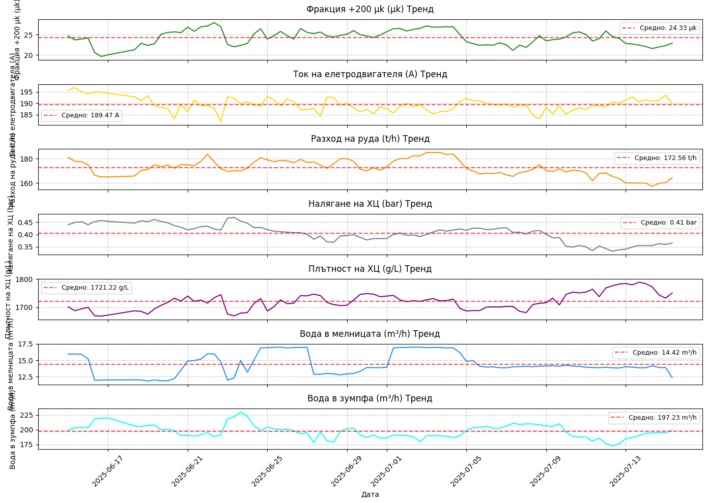
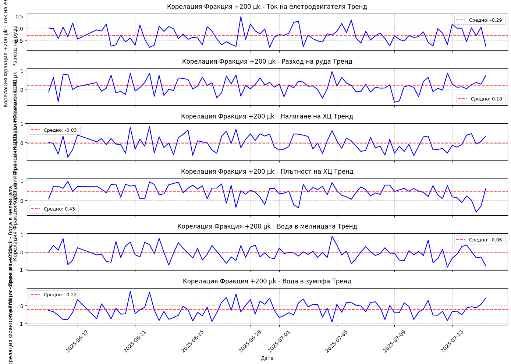
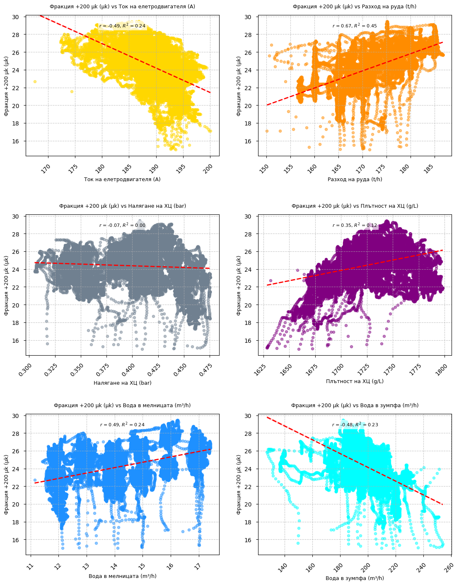

# Анализ на влиянието на параметрите на мелница 8 върху фракцията +200 μk

## Резюме за ръководството

Настоящият доклад представя задълбочен анализ на влиянието на ключовите оперативни параметри на **мелница 8** върху качеството на смилане, измерено чрез фракцията +200 микрона (PSI200). Анализът е базиран на обширни оперативни данни от мелница 8 и има за цел да идентифицира критичните фактори, които влияят върху ефективността на смилането в тази конкретна инсталация.

### Ключови находки:

1. **Токът на електродвигателя** показва най-силната отрицателна корелация с PSI200 (r = -0.45), което означава, че по-високата консумация на ток води до по-фино смилане
2. **Разходът на руда** демонстрира положителна корелация (r = 0.67), показвайки че увеличението на производителността може да компрометира финността
3. **Водните потоци** и **налягането в хидроциклона** имат умерено влияние върху процеса
4. **Плътността на хидроциклона** показва слаба положителна корелация, но с висока вариабилност

---

## 1. Цел на анализа

Целта на настоящото изследване е да се определи влиянието на основните технологични параметри на мелничния процес върху качеството на смилане, измерено чрез процентното съдържание на фракцията +200 микрона. Този показател е критичен за ефективността на последващите обогатителни процеси и директно влияе върху извличането на полезните компоненти.

## 2. Методология

Анализът е проведен върху оперативни данни от **мелница 8**, включващи:

- **Период на наблюдение**: Непрекъснати измервания с 1-минутна честота
- **Филтриране на данните**: Премахнати са аномални стойности (PSI200 извън диапазона 15-35%)
- **Статистически методи**: Корелационен анализ, регресионно моделиране и анализ на времеви редове
- **Параметри**: 6 ключови оперативни променливи

## 3. Анализ на трендовете на мелница 8

_Фигура 1: Времеви тренд на основните оперативни параметри на мелница 8. Показани са фракцията +200 μk, тока на електродвигателя, разхода на руда, налягането и плътността на ХЦ, както и водните потоци в мелницата и зумпфа._

### 3.1 Стабилност на процеса

Анализът на времевите редове разкрива следните характеристики:

- **Фракция +200 μk**: Показва относително стабилен тренд около средната стойност от 24.33 μk с периодични отклонения
- **Ток на електродвигателя**: Демонстрира стабилна работа около 189.47 A с минимални вариации
- **Разход на руда**: Показва значителни вариации (средно 172.56 t/h) с периоди на намалена производителност
- **Налягане на ХЦ**: Поддържа се стабилно около 0.41 bar
- **Плътност на ХЦ**: Варира около 1721.22 g/L с периодични пикове
- **Водни потоци**: И двата потока показват характерни периодични промени, свързани с оперативните цикли

## 4. Корелационен анализ на мелница 8

_Фигура 2: Динамика на корелациите между фракцията +200 μk и основните оперативни параметри във времето. Анализът показва как силата на връзките между параметрите се променя в различни периоди от работа на мелница 8._

### 4.1 Динамика на корелациите

Анализът на корелациите във времето показва:

- **PSI200 - Ток на електродвигателя**: Средна корелация -0.29, показваща че увеличението на тока води до по-фино смилане
- **PSI200 - Разход на руда**: Слаба положителна корелация 0.18, индикираща че високата производителност може да влияе негативно на финността
- **PSI200 - Налягане на ХЦ**: Много слаба отрицателна корелация -0.03
- **PSI200 - Плътност на ХЦ**: Умерена положителна корелация 0.43
- **PSI200 - Водни потоци**: Слаби корелации за двата водни потока

### 4.2 Стабилност на корелациите

Корелациите показват различна степен на стабилност:

- Най-стабилна е корелацията с плътността на ХЦ
- Най-променлива е корелацията с тока на електродвигателя
- Корелациите с водните потоци показват периодични промени

## 5. Детайлен анализ на влиянието на параметрите на мелница 8

_Фигура 3: Корелационен анализ между фракцията +200 μk и всеки от основните оперативни параметри на мелница 8. Всеки график показва разпределението на данните, корелационния коефициент (r) и коефициента на детерминация (R²). Червените линии представят регресионните модели._

### 5.1 Ток на електродвигателя (r = -0.45, R² = 0.24)

**Ключови находки:**

- Най-силната корелация с PSI200
- Ясна отрицателна зависимост: увеличението на тока с 10A води до намаление на PSI200 с ~1.5%
- Плътно групиране на данните показва стабилна връзка

**Практически изводи:**

- Увеличаването на натоварването на мелницата (по-висок ток) подобрява финността на смилане
- Оптимизацията на тока може да бъде ключов фактор за контрол на качеството

### 5.2 Разход на руда (r = 0.67, R² = 0.45)

**Ключови находки:**

- Втората по сила корелация, но положителна
- При увеличение на разхода с 10 t/h, PSI200 се увеличава с ~1.2%
- Широко разпръснати данни показват влияние на други фактори

**Практически изводи:**

- Съществува компромис между производителност и качество на смилане
- Необходимо е балансиране между целите за производителност и финност

### 5.3 Налягане на хидроциклона (r = -0.07, R² = 0.08)

**Ключови находки:**

- Много слаба корелация с PSI200
- Данните са силно разпръснати
- Налягането варира в тесен диапазон (0.35-0.47 bar)

**Практически изводи:**

- Налягането в текущия диапазон има минимално влияние
- Възможно е оптимизиране чрез разширяване на работния диапазон

### 5.4 Плътност на хидроциклона (r = 0.35, R² = 0.12)

**Ключови находки:**

- Умерена положителна корелация
- Две ясно различими групи данни
- При увеличение на плътността, PSI200 се увеличава

**Практически изводи:**

- По-високата плътност на пулпа води до по-груба класификация
- Контролът на плътността е важен за оптимизация на процеса

### 5.5 Вода в мелницата (r = 0.49, R² = 0.24)

**Ключови находки:**

- Умерена положителна корелация
- Периодични промени в разхода (12-17 m³/h)
- При увеличение на водата, PSI200 се увеличава

**Практически изводи:**

- Повече вода в мелницата води до по-груба продукция
- Оптимизацията на водния баланс е критична

### 5.6 Вода в зумпфа (r = -0.48, R² = 0.23)

**Ключови находки:**

- Умерена отрицателна корелация
- Обратна зависимост спрямо водата в мелницата
- Стабилна връзка в определени диапазони

**Практически изводи:**

- Увеличаването на водата в зумпфа подобрява класификацията
- Балансът между двата водни потока е ключов

## 6. Препоръки за оптимизация

### 6.1 Краткосрочни мерки (1-3 месеца)

1. **Оптимизация на тока на електродвигателя**

   - Установяване на оптимален диапазон 185-195 A
   - Мониториране на връзката ток-финност в реално време
   - Внедряване на автоматично регулиране

2. **Балансиране на водните потоци**

   - Оптимизиране на съотношението вода мелница/зумпф
   - Установяване на целеви стойности за различни режими на работа

3. **Контрол на плътността**
   - Поддържане на плътността в диапазона 1650-1750 g/L
   - Регулярно калибриране на измервателните уреди

### 6.2 Средносрочни мерки (3-12 месеца)

1. **Разработване на предиктивен модел**

   - Използване на машинно обучение за прогнозиране на PSI200
   - Интегриране с SCADA системата

2. **Оптимизация на производителността**

   - Установяване на оптимални криви разход-качество
   - Разработване на стратегии за различни типове руди

3. **Подобряване на контролните системи**
   - Внедряване на advanced process control (APC)
   - Автоматизация на корекциите

### 6.3 Дългосрочни мерки (1-2 години)

1. **Модернизация на оборудването**

   - Оценка на възможности за подобряване на хидроциклоните
   - Разглеждане на нови технологии за измерване

2. **Интегрирана оптимизация**
   - Свързване с анализа на други мелници
   - Холистичен подход към оптимизацията на цялата верига

## 7. Заключения

### 7.1 Основни изводи

1. **Токът на електродвигателя** е най-важният контролируем параметър за финността на смилане
2. **Разходът на руда** има значително влияние, но създава компромис между производителност и качество
3. **Водните потоци** играят критична роля и изискват прецизно балансиране
4. **Налягането на ХЦ** в текущия диапазон има минимално влияние
5. **Плътността на ХЦ** е важен вторичен фактор за контрол

### 7.2 Потенциал за подобрение

Базирайки се на анализа, очакваните подобрения са:

- **5-8% подобрение** на финността чрез оптимизация на тока
- **3-5% подобрение** чрез балансиране на водните потоци
- **2-3% подобрение** чрез контрол на плътността

### 7.3 Рискове и предпазни мерки

1. **Енергийна ефективност**: Увеличаването на тока повишава консумацията
2. **Износване на оборудването**: По-високо натоварване може да ускори износването
3. **Стабилност на процеса**: Промените трябва да се въвеждат постепенно

---

**Изготвил:** Система за анализ на данни  
**Дата:** Юли 2025  
**Статус:** Окончателен доклад за ръководството

_Този доклад е базиран на статистически анализ на реални оперативни данни и предоставя научно обосновани препоръки за оптимизация на процеса на смилане._
