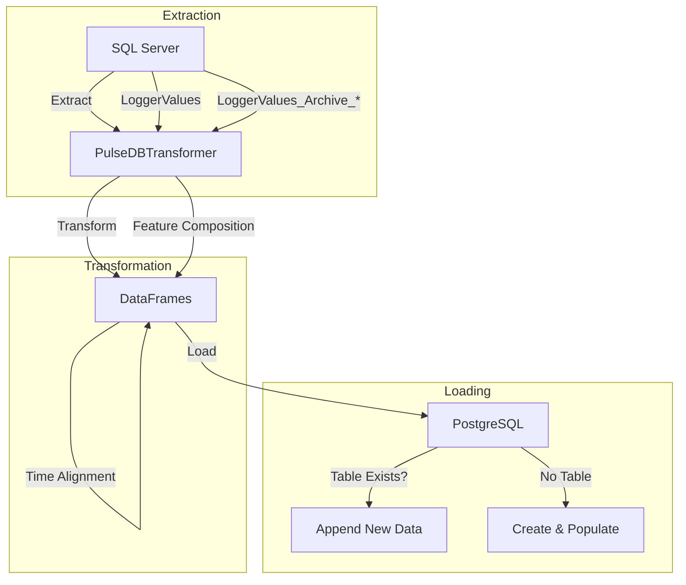
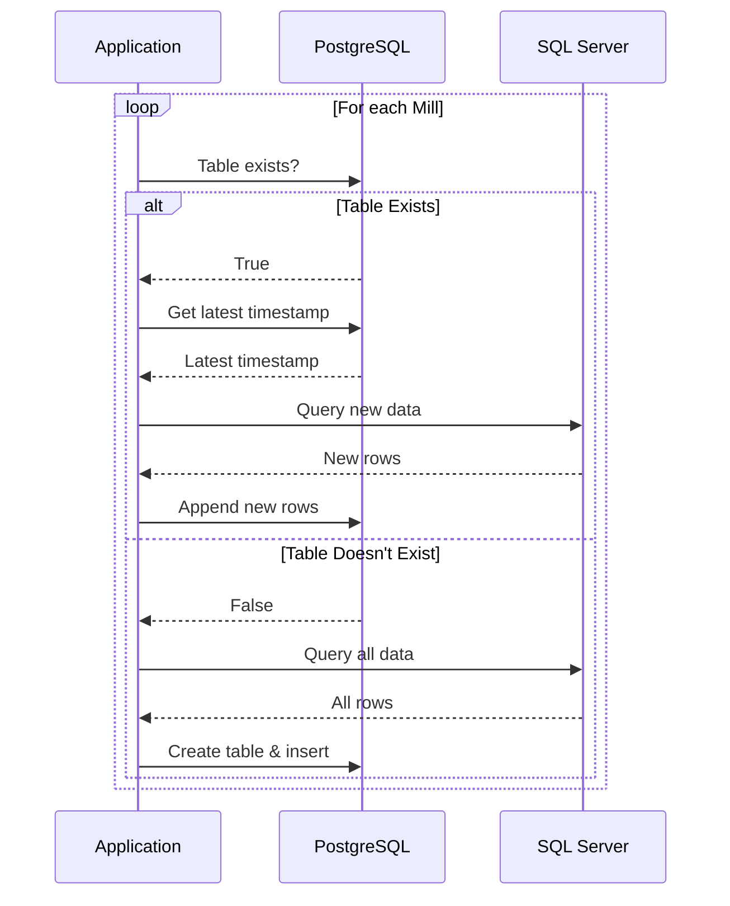
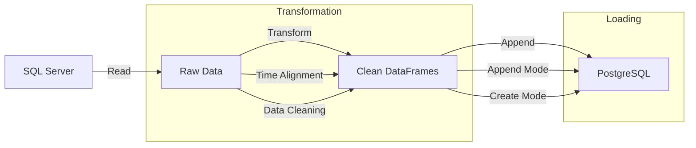

# Pulse to PostgreSQL Transformer

```mermaid
classDiagram
    class PulseDBTransformer {
        +str server = '10.20.2.10'
        +str database = 'pulse'
        +str username = 'Pulse_RO'
        +str password = 'PD@T@r3@der'
        +list mills = ['Mill01', 'Mill02', ..., 'Mill12']
        +dict sql_tags = {sensor_type: {tag_id: mill_name}}
        +list table_names = ['LoggerValues', 'LoggerValues_Archive_Jun2025']
        +datetime filter_timestamp = None
        +bool creating_new_table = False
        +__init__(pg_host, pg_port, pg_dbname, pg_user, pg_password)
        +read_sql_table(table_name, feature) DataFrame
        +compose_feature(feature) DataFrame
        +create_mill_dataframe(mill) DataFrame
        +save_to_postgresql(schema='mills')
        +append_to_postgresql(schema='mills')
        -_repopulate_table(mill, schema, table_name)
    }
```

## Overview

ETL solution for synchronizing mill sensor data from SQL Server to PostgreSQL with efficient incremental updates.

## Table of Contents
1. [System Architecture](#system-architecture)
2. [Core Methods](#core-methods)
3. [Append Functionality](#append-functionality)
4. [Data Flow](#data-flow)
5. [Usage Examples](#usage-examples)
6. [Best Practices](#best-practices)

## System Architecture



## Class Structure

The main class `PulseDBTransformer` handles the entire ETL process. It maintains connections to both source (SQL Server) and target (PostgreSQL) databases, and provides methods for data extraction, transformation, and loading.

### Initialization

```python
def __init__(self, pg_host='localhost', pg_port=5432, pg_dbname='em_pulse_data', 
             pg_user='postgres', pg_password='postgres'):
    # SQL Server connection parameters
    self.server = '10.20.2.10'
    self.database = 'pulse'
    self.username = 'Pulse_RO'
    self.password = 'PD@T@r3@der'
    # ... (connection setup)
    
    # Mill names and sensor tags
    self.mills = ['Mill01', 'Mill02', ..., 'Mill12']
    
    # Sensor tags mapping
    self.sql_tags = {
        'Ore': {"485": "Mill01", ...},
        'WaterMill': {"560": "Mill01", ...},
        # ... other sensor types
    }
    
    # Source tables to query
    self.table_names = ['LoggerValues', 'LoggerValues_Archive_Jun2025']
    
    # State variables
    self.filter_timestamp = None
    self.creating_new_table = False
```

## Core Methods

### read_sql_table

Reads and processes data from SQL Server for a specific sensor feature.

```python
def read_sql_table(self, table_name, feature):
    """
    Read and process data from SQL Server for a specific feature.
    
    Args:
        table_name (str): Source table name
        feature (str): Sensor feature name (e.g., 'Ore', 'WaterMill')
    """
    # Build tag conditions for the query
    tag_conditions = " OR ".join(
        [f"LoggerTagID = {tag_id}" for tag_id in self.sql_tags[feature].keys()]
    )
    
    # Construct WHERE clause based on operation mode
    where_clauses = [f"({tag_conditions})"]
    
    # Apply time filters if not creating a new table
    if not self.creating_new_table and self.filter_timestamp is not None:
        since_str = self.filter_timestamp.strftime('%Y-%m-%d %H:%M:%S')
        where_clauses.append(f"IndexTime > '{since_str}'")
    
    # Build and execute the query
    query_str = f"""
    SELECT TOP 1000000 IndexTime, LoggerTagID, Value 
    FROM {table_name} 
    WHERE {" AND ".join(where_clauses)}
    ORDER BY IndexTime DESC
    """
    
    # Execute query and process results
    df = pd.read_sql_query(query_str, self.engine)
    
    if not df.empty:
        # Pivot and resample data
        df = df.drop_duplicates(subset='IndexTime', keep='last')
        df = df.pivot(index="IndexTime", columns="LoggerTagID", values="Value")
        df = df.ffill().bfill()
        df = df.resample("1min").mean()
        
        # Map column names to mill names
        df.columns = [
            self.sql_tags[feature][str(k)] 
            for k in df.columns 
            if str(k) in self.sql_tags[feature]
        ]
        df.index.names = ['TimeStamp']
        df.sort_index(axis=1, inplace=True)
    
    return df if not df.empty else pd.DataFrame()
```

### compose_feature

Combines data from all source tables for a specific feature.

```python
def compose_feature(self, feature):
    """Combine data from all tables for a specific feature"""
    frames = []
    for tbl in self.table_names:
        frames.append(self.read_sql_table(tbl, feature))
    
    # Concatenate and process all data
    df = pd.concat(frames)
    # ...
    return df
```

### create_mill_dataframe

Creates a consolidated DataFrame for a specific mill with all sensor features.

```python
def create_mill_dataframe(self, mill):
    """Create a dataframe for a specific mill with all features"""
    all_data = []
    # Process each feature and combine
    # ...
    return mill_df
```

### save_to_postgresql

Saves all mill data to PostgreSQL, replacing any existing data.

```python
def save_to_postgresql(self, schema='mills'):
    """Save all mill data to PostgreSQL database, replacing existing data"""
    # Implementation details...
```

### append_to_postgresql

Appends new data to existing PostgreSQL tables, only adding records newer than the latest timestamp.

```python
def append_to_postgresql(self, schema='mills'):
    """Append new data to existing PostgreSQL database tables"""
    # Implementation details...
```

### _repopulate_table

Helper method to completely repopulate a table with fresh data.

```python
def _repopulate_table(self, mill, schema, table_name):
    """Helper method to repopulate a table with fresh data"""
    # Implementation details...
```

## Append Functionality

### Append Process Flow



### Key Features

1. **Smart Data Fetching**
   - Only retrieves new records using timestamp filtering
   - 2.5-hour buffer to handle timezone differences
   - Efficient SQL queries with proper indexing

2. **Automatic Recovery**
   - Creates missing tables automatically
   - Handles schema changes gracefully
   - Recovers from partial failures

3. **Performance Optimizations**
   - Bulk inserts for better throughput
   - Connection pooling
   - Memory-efficient data processing

## Data Flow



## Usage Examples

### Initial Data Load

```python
transformer = PulseDBTransformer(
    pg_host='em-m-db4.ellatzite-med.com',
    pg_port=5432,
    pg_dbname='em_pulse_data',
    pg_user='s.lyubenov',
    pg_password='your_password'
)
transformer.save_to_postgresql(schema='mills')
```

### Incremental Update

```python
transformer = PulseDBTransformer(
    pg_host='em-m-db4.ellatzite-med.com',
    pg_port=5432,
    pg_dbname='em_pulse_data',
    pg_user='s.lyubenov',
    pg_password='your_password'
)
transformer.append_to_postgresql(schema='mills')
```

## Best Practices

1. **Scheduling**
   - Run every 15-30 minutes for near real-time updates
   - Use systemd or Windows Task Scheduler

2. **Monitoring**
   - Check logs for errors
   - Monitor database performance
   - Set up alerts for failures

3. **Maintenance**
   - Regular backups
   - Monitor table growth
   - Periodically vacuum/analyze tables

4. **Performance**
   - Ensure proper indexes exist
   - Monitor query performance
   - Consider table partitioning for large datasets

## Usage Examples

### Initial Data Load

```python
transformer = PulseDBTransformer(
    pg_host='your_host',
    pg_port=5432,
    pg_dbname='your_db',
    pg_user='your_user',
    pg_password='your_password'
)

transformer.save_to_postgresql(schema='mills')
```

### Incremental Update

```python
transformer = PulseDBTransformer(
    pg_host='your_host',
    pg_port=5432,
    pg_dbname='your_db',
    pg_user='your_user',
    pg_password='your_password'
)

transformer.append_to_postgresql(schema='mills')
```

## Error Handling

The script includes comprehensive error handling:

- Database connection errors
- Missing tables
- Data integrity issues
- Network timeouts

All errors are logged with detailed messages to help with troubleshooting.

## Best Practices

1. **Scheduling**: Run the append operation frequently (e.g., every 15-30 minutes) for near real-time updates
2. **Monitoring**: Check logs regularly for any errors or warnings
3. **Backup**: Ensure you have regular backups of the PostgreSQL database
4. **Performance**: The script is optimized for performance, but monitor database performance with frequent updates
